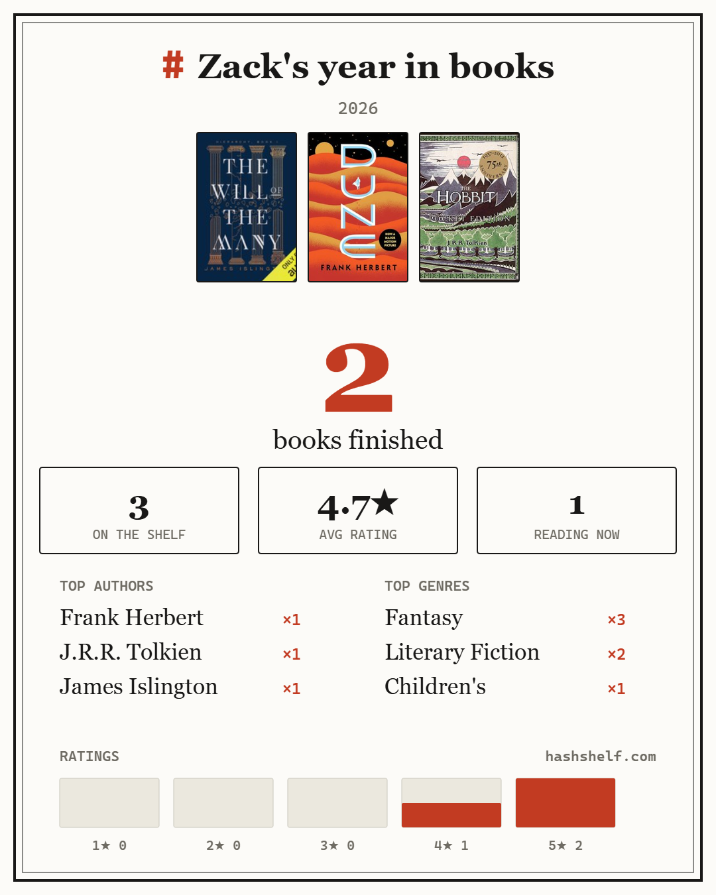

# HashShelf

[](https://github.com/ZackBot98/hashshelf-flask-website/actions/workflows/ci.yml)

A hash-driven book tracker. No accounts. A link is the data.

Live at **[hashshelf.com](https://hashshelf.com)** · [About / manifesto](https://hashshelf.com/about.html)

<p align="center">
  
</p>

## What it does

- Add books by OpenLibrary Work ID (e.g. `OL45804W`) or ISBN, or search by title.
- Set rating (0–5) and status (`want` / `reading` / `finished` / `did not finish`). Books carry no free-text notes.
- Hydrate titles/authors/covers/genres from OpenLibrary — via the HashShelf API cache when available, directly from OpenLibrary otherwise.
- **Multiple shelves**, switched locally; each shares as its own link.
- **Goodreads CSV import**: drop in a `goodreads_library_export.csv` and the shelf fills in. Maps Goodreads' shelves to statuses and keeps ratings (written reviews are not imported), and reports rows it had to skip (no ISBN).
- **Compare shelves**: paste someone's link to see overlap, books only they have, and where your ratings disagree most — then add their books to your want list in one click.
- **Year in review**: a shareable PNG card (covers, counts, top authors/genres, rating distribution), rendered entirely client-side.
- Filter by status **and genre**; genres are derived from OpenLibrary subjects, not stored in the link.
- Live link: the URL hash updates as you edit. "Create HashShelf" copies a shareable link — the full, self-contained hash link, which carries the whole shelf and never touches the server.
- Open any HashShelf link to reconstruct the list deterministically. "Copy to my shelf" imports someone else's shelf into your own.
- Each shelf's name is the title shown on links you share (it travels in the hash; the schema's `name` field carries it).
- Installable PWA; works offline after first load.

## Design invariant

**The URL hash is the source of truth — and the only place a shelf lives.** The hash link is always a complete, self-contained copy of the shelf, and because it's a URL fragment it is never sent to the server. The server stores **no user content**: the database is purely a disposable OpenLibrary cache. Losing the backend never loses data, and the app still works served as plain static files.

## Snapshot format

Canonical JSON (deterministic ordering/whitespace):

```json
{
  "v": 1,
  "name": "optional short title",
  "books": [
    { "idType": "work|edition|isbn", "id": "string", "rating": 0, "status": "want|reading|finished|did not finish" }
  ]
}
```

Canonicalization rules:

- `books` normalized, deduped per `(idType, id)` (last write wins), and sorted by `id` asc (tie-break `idType`), using locale-independent code-unit comparison. Books carry no free text — a `comment` on any incoming book is dropped.
- `name` is the only free text; `sanitizeName` (in `snapshot.js`) strips any URL or bare domain and caps it at 50 chars. This runs on **both encode and decode**, so a hand-crafted or legacy link can't smuggle a link into the title.
- Keys inserted in fixed order; empty/undefined fields omitted.

Encoding:

- Payload = raw deflate (fflate, vendored) of the canonical JSON, base64-url encoded.
- Integrity suffix = first 12 hex chars of SHA-256 over the **deflated bytes** (48-bit). This detects corruption/truncation of shared links; it is a checksum, not authentication.
- Final link: `https://hashshelf.com/#<payload>.<hash>` — self-contained; the fragment carries the whole shelf and is never sent to the server.

## Architecture

```
index.html         SPA shell (editor + viewer + compare + wrapped modal)
about.html         Manifesto ("the rules"), linked from the header
guide.html         Feature how-to, linked from the header
styles.css         "Card Catalog" design: paper/ink/stamp-red, serif + mono,
                   ruled rows; warm-charcoal dark variant via prefers-color-scheme
snapshot.js        Canonicalize + deflate + base64url + SHA-256 integrity
openlibrary.js     Metadata hydration: API-first with direct-OpenLibrary fallback
config.js          Affiliate ids (public by design) — the only file to edit to go live
lib.js             Pure logic: CSV import, genre mapping, compare, wrapped card, buy links
ui.js              Rendering, events, shelves, filters, clipboard, live hash
genres.json        Genre rules, shared by server.py and lib.js
service-worker.js  Asset + API cache (7d TTL), offline support
vendor/fflate.min.js  Vendored fflate 0.8.2 (hash-verified against npm)
server.py          Flask: static serving + OpenLibrary API cache +
                   security headers + background cache prewarmer
render.yaml        Render blueprint (Starter + persistent disk)
_headers           Same security headers for static hosting (CF Pages fallback)
.github/           CI: all three test suites on every push
tests/             Unit tests (2 Node suites + hermetic Python server suite)
TESTING.md         Test plan: automated suites, manual matrix, release checklist
```

Run tests from the repo root:

```bash
node tests/test-snapshot.js
node tests/test-lib.js
python -m unittest discover tests
```

Client state lives in the URL hash (shareable snapshot), `localStorage` (shelves, hydration cache, own-link set), and the Service Worker cache. Shelves are stored under `shelves:v1`; a pre-v1.3 single `booksDraft` is migrated automatically on first load.

### Genres

OpenLibrary subjects are messy free text ("Fiction, science fiction, general", "nyt:bestseller", "Science-fiction"). `genres.json` maps them to a small display set and is the **single source of truth**, loaded by both the server and the browser. Matching is punctuation-insensitive, each subject counts toward at most one genre, and rules run specific-before-general so "Science fiction" never also counts as "Science". Genres are hydration metadata — they never enter the snapshot, so links stay compact.

### API (all optional — the client falls back to OpenLibrary directly)

- `POST /api/books` — bulk hydration: `{books: [{idType, id}]}` → assembled `{title, authors, coverUrl, genres, workId}` per book. SQLite-cached (60d TTL), so OpenLibrary is hit at most once per book per TTL across *all* users. The client batches same-tick requests, so rendering a whole shelf is one round trip.
- `GET /api/search?q=` — cached OpenLibrary search (24h TTL) with English-edition title/cover enrichment done server-side.
- `GET /healthz` — `{ok, version, db_on_disk, books_cached}`; `db_on_disk` confirms the SQLite file lives on the persistent disk, `books_cached` makes cache growth observable.

The API is only an OpenLibrary cache — there is **no endpoint that stores shelves**. Shelves live entirely in their links.

A **background prewarmer** (on real servers only — activated by Render's `RENDER` env var, or a direct `python server.py` run) slowly stocks the cache with popular books: OpenLibrary's trending lists, then paginated subject walks, ≤ ~30 books/hour through the same rate-limited pipeline. Already-cached books are skipped before any upstream call, and the ladder cursor persists in the DB so restarts resume the walk instead of rereading page one. Tests and CI never start it.

Failures are never cached, stale data is served in preference to errors, upstream calls are rate-limited with a global token bucket and retried with backoff on 429/5xx, and concurrent identical hydrations are deduped. `workId` is what lets Compare match the same book added by ISBN on one shelf and by work ID on another.

Known rough edge: a large cold import can still see a few books fail hydration when OpenLibrary throttles. Those failures are never cached, the client falls back to calling OpenLibrary directly, and a later view fills them in.

## Develop locally

```bash
pip install -r requirements.txt
python server.py
```

Open `http://localhost:8000`. For phone testing on your LAN, use `http://<your-LAN-IP>:8000` (the app is designed to work on plain HTTP: portable SHA-256, clipboard fallbacks; the service worker itself requires HTTPS or localhost).

Static-only development still works too (`python -m http.server 5173` from the repo root) — the client just uses the direct OpenLibrary path.

## Deploy

### Render (current target)

The repo contains a `render.yaml` blueprint: Render → New → Blueprint → connect the repo. It runs `gunicorn` serving `server:app`.

- The blueprint provisions the paid setup: **Starter instance + 1 GB persistent disk** at `/var/data` with `HASHSHELF_DB` pointing at it — always-on, and the OpenLibrary cache survives deploys (verify via `db_on_disk` in `/healthz`). On the free plan the app still works (the client's fallback covers cold starts), but the filesystem is ephemeral, so the cache resets on every restart. No user data is ever at stake — the server stores none; the disk holds only the disposable book cache.
- Point `hashshelf.com` at the Render service (add the custom domain in Render, update the DNS record in Cloudflare, keep the proxy on for CDN caching). Bump `CACHE_NAME` in `service-worker.js` on deploys that change assets.

### Static hosting (Cloudflare Pages, GitHub Pages, Netlify…)

Fully supported, at parity — publish the repo root as-is. There are no server-side shelf features to lose: shelves live entirely in their links, and the client hydrates straight from OpenLibrary. (You only forgo the server-side cache that trims repeat OpenLibrary calls.)

## Affiliate links

Buy links are driven entirely by [`config.js`](config.js): with an id set, each
book row gets Amazon + Audiobook links and the required disclosure appears in
the footer; with none set, neither renders. hashshelf.com ships with its Amazon
id configured — if you run a copy locally, clear or replace it.

- Amazon links use the ISBN-10 (which is the ASIN for print books), derived from
  the ISBN-13 when needed; 979-prefixed ISBNs and books with no ISBN fall back to
  a search link that still carries attribution.
- An **Audiobook** link accompanies each Amazon link: a tagged search constrained
  to the Audible catalog (audiobook ASINs aren't derivable from ISBNs), built
  from the book's title and author.
- Books added by *work* id have no ISBN of their own, so hydration stores a
  representative English-edition ISBN (`work_editions.en_isbn`) — this is what
  lets every book link out, not just ISBN-added ones.
- Links carry `rel="sponsored nofollow noopener noreferrer"` and open in a new tab.
- No tracking scripts are added: these are plain outbound URLs, so the
  no-analytics, no-accounts posture is unchanged.

## Security & privacy

- **The server stores no user content.** Shelves live only in their links; the database is a disposable OpenLibrary cache with no accounts, no cookies, and nothing tying data to a person. (The hosting layer's standard access logs exist, as with any web host.)
- Strict security headers on every response: CSP (`script-src 'self'` — no inline code exists anywhere, enforced by tests; only OpenLibrary/Internet Archive hosts allowed for data and covers), HSTS, `nosniff`, frame denial, and a tight referrer policy. Third-party scripts are browser-refused, not merely absent.
- Snapshots (the shelf encoding carried in a link) are deterministic and integrity-checked — corruption detection, not authentication.
- Shelf data leaves the browser only inside a link you choose to share, and that link — a URL fragment — is never transmitted to any server.
- All rendering uses `textContent` — a shelf name from a shared link cannot inject HTML and is never turned into a clickable link.
- **The codec is the link-free boundary.** A shelf's only free text is its (short) name; books have no comment field at all. `sanitizeName` strips URLs and bare domains and caps length on **both encode and decode**, so a hand-crafted or legacy link can't smuggle a link into a title either. The shelf-name form adds a friendly rejection on top.

## Contributing

Issues and ideas are welcome. The bar for changes: all three test suites pass
(CI runs them on every push), the static-only fallback keeps working, and
nothing ever requires a user account. Contributions are accepted under the
project's license.

## License

[Elastic License 2.0](LICENSE) — source-available. Read it, audit it, run it
locally, send fixes. The one thing you may not do is offer HashShelf (or a
substantial copy of it) as a hosted service to other people. That keeps every
privacy claim on the [About page](https://hashshelf.com/about.html)
independently verifiable while keeping hashshelf.com the only HashShelf.
